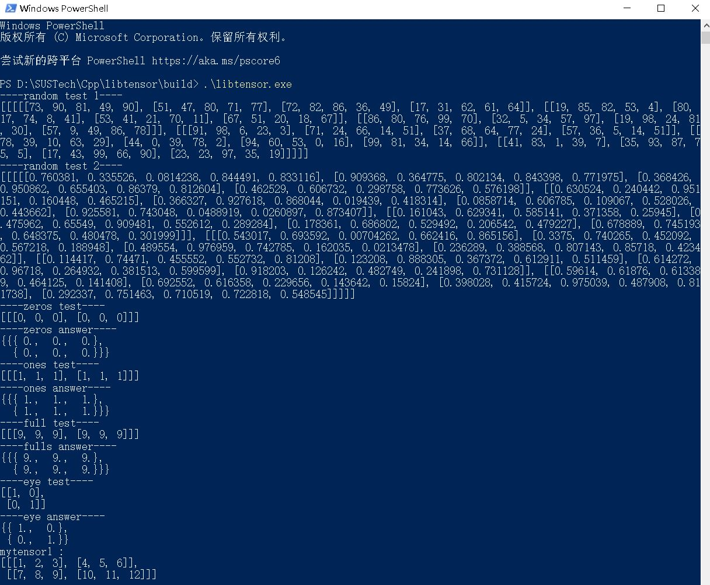

# libtensor
谢尚儒 12112017

牛牧 12112004

张洪铭 12112015

### 测试介绍

测试使用main打印输出，与xtensor相同功能直接比对答案,高级功能如einsum放置main结尾演示使用方法。具体的比对在main中有详细介绍。

libtensor.exe是main的可运行程序。经测试可以正常使用。

Tensor operations部分功能通过打印地址说明tensor传回的是数据引用而非拷贝。

### 测试部分截图

